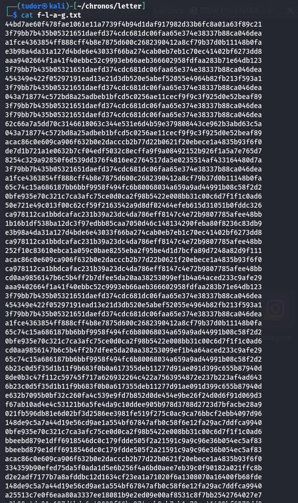
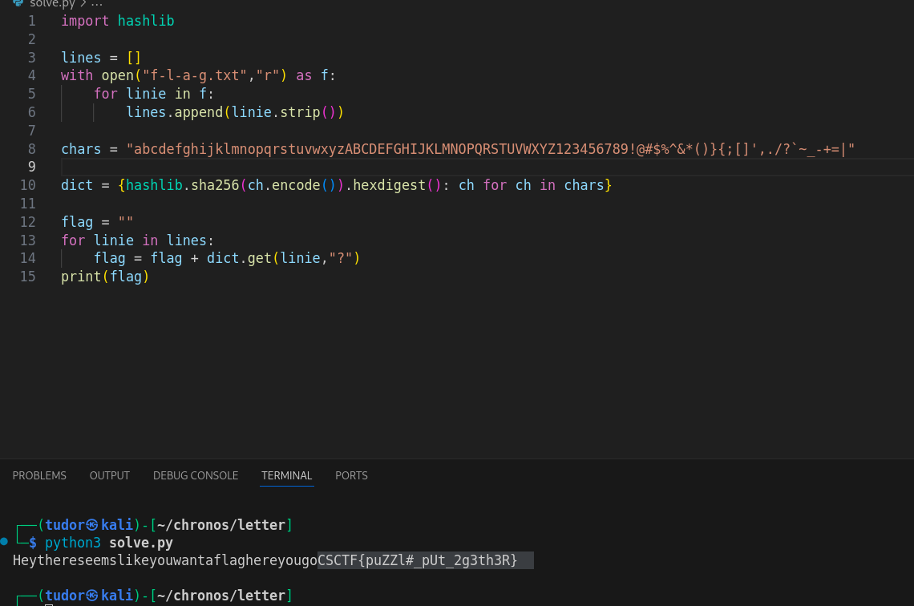

## Letter -> 100p
# Category => Cryptography

---

The file contains hashes : all are 64 hex = 256 bits => SHA-256 hashes

The phrase "You can read it, just take it step-by-step." makes me think that every hash is just one character from the flag. I will write a script:

