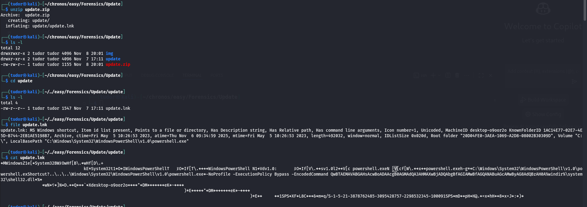
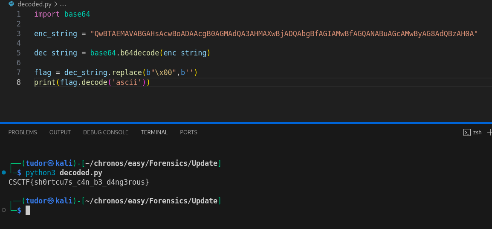

## Update -> 100p
# Category => Forensics

---

This shortcut is designed to execute a hidden Powershell command.
This is a classic technique used by attackers to run malicious code

`\powershell.exe -NoProfile -ExecutionPolicy Bypass -EncodedCommand QwBTAEMAVABGAHsAcwBoADAAcgB0AGMAdQA3AHMAXwBjADQAbgBfAGIAMwBfAGQANABuAGcAMwByAG8AdQBzAH0A`

-> ExecutionPolicy Bypass = this instructs powershell to ignore the system's script execution policy, allowing any script to run

-> EncodedCommand = this tells that the string is base64-encoded

Let's decode it:

There's the flag!