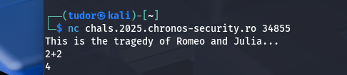
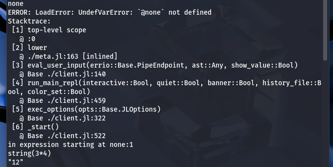
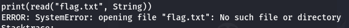
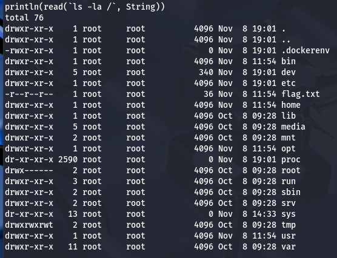
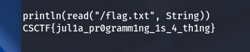

## Romeo and Julia -> X p
# Category => Misc

---

Soon as we connect to the remote server, we get this reply: 

`This is the tragedy of Romeo and Julia...`.

Since the name of the challenge is `Romeo and Julia` and the font of Julia is bold in the description, this challenge might be related to the `Julia programming language`

 ## https://docs.julialang.org/en/v1/stdlib/REPL/ (for more info)

Let's test if this is true:

Nice! We are in a Julia REPL on the remote host(".jl" extension)
We have to use Julia functions:

If I want to explicitly run shell commands, I must use the backticks.

Apparently, the flag is not in the cwd. Let's take a quick peek at the root directory: 

There it is our flag `flag.txt`

