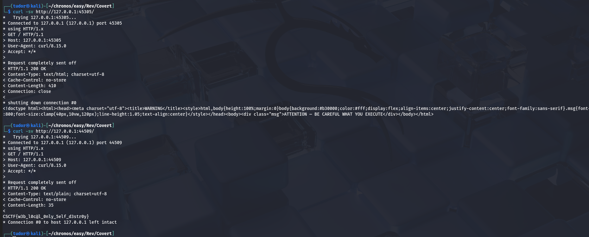

## Covert -> 100p
# Category => Rev

---

This binary starts a local HTTP server and opens the browser to that url, displaying a warning message.

I ran the command `strings` and found different informations about this server program.

This binary tipically calls socket(), listen(), accept() in a loop. I will let the process run in a terminal, and from another I will initiate a connection to the local server.

`netstat -ltnp 2>/dev/null | grep webnote`

-l => only listening sockets
-t => only tcp sockets

So the same process webnote is listening on two different loopback ports.

Let's connect to both of them ports:

