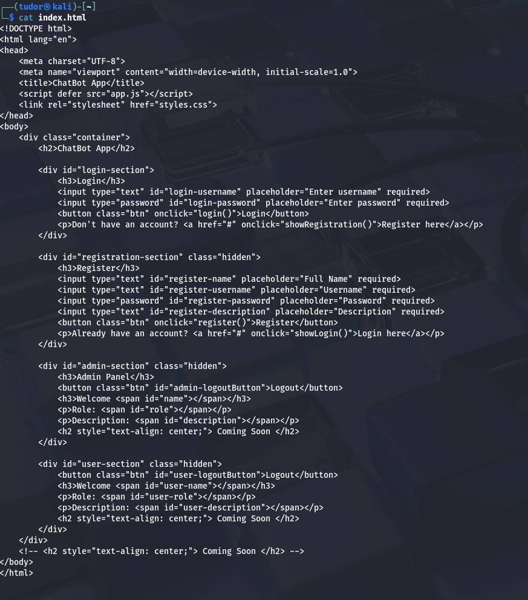
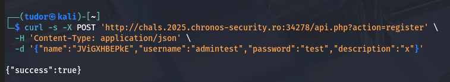

## Chatbot-V1 -> 347p
# Category => Web

---

I tried some SQL Injection but it didn't worked.
I made a new account, logged in, and on the main page there was a message "Role: user".

Maybe I can set my role as admin or something like that?
The params from the login/register form were sent in a json format.

The HTML presents 2 important things:

-> `app.js` the front-end(included with defer). this is probably where the role:admin logic is
-> the server does not send our role to login(backend returns only name, username, desciption) so the role is determiined by client(potential vulnerability). If the role is only in UI, I can change it locally

I downloaded the obfuscated app.js(but sill readable after a bit of decoding) and inside it I found the name `JViGXHBEPkE` and how to become admin(registerr with that name)

First, I made a new account using the exact name "JViGXHBEPkE":

I logged in with the credentials "admintest":"test" and the flag was there!
