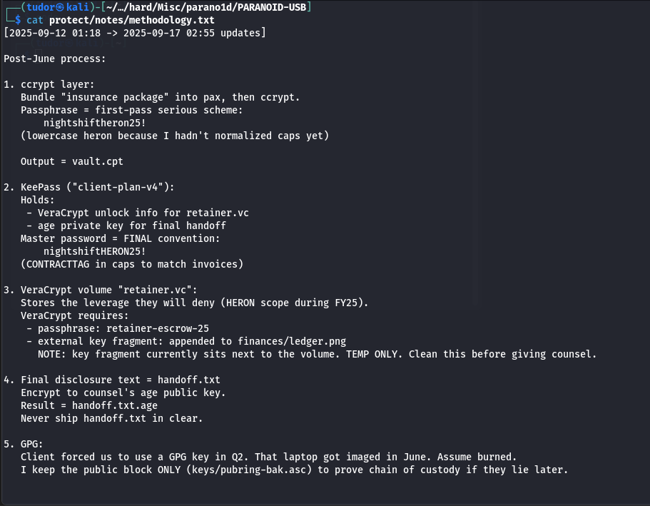
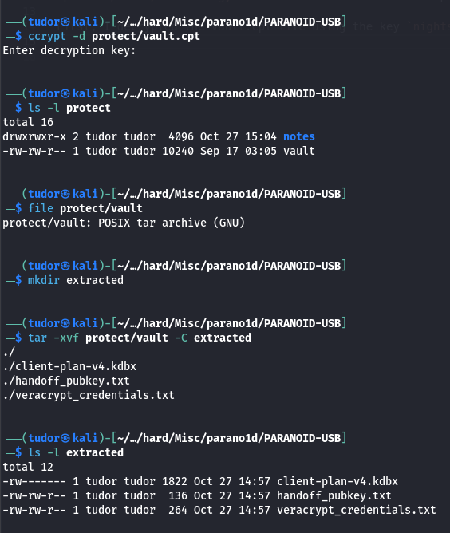
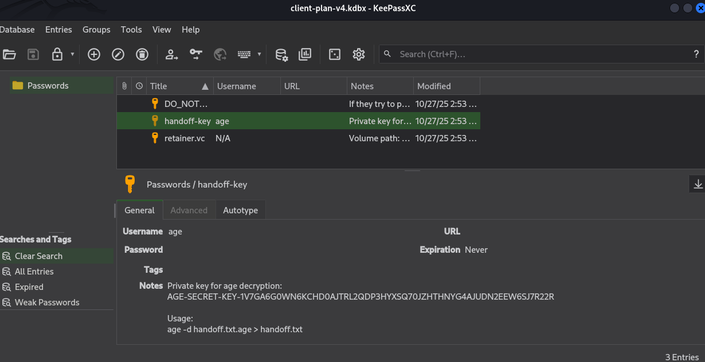
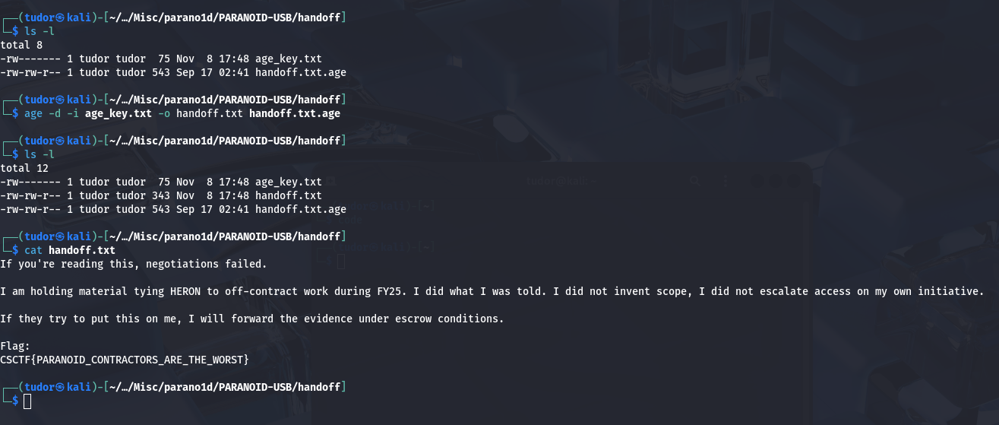

## Parano1d -> 100p
# Category => Misc

---

After analyzing the extracted files from the archive, I focused on those files:

`protect/vault.cpt` - ccrypt encrypted archive



`protect/notes/methodology.txt` - file that contains the passwords for different type of decryptions

First, I decrypted the vault.cpt file using the key `nightshiftheron25!` from methodology.txt. The resulted file was a POSIX tar archive.
I extracted it and followed the chain to the flag.



`client-plan-v4.kdbx` = KeyPass DB(contains age private key)

``` bash
4. Final disclosure text = handoff.txt
   Encrypt to counsel's age public key.
   Result = handoff.txt.age
   Never ship handoff.txt in clear.


```
`age`(actually good encryption) = modern encryption tool, safer alternative to GPG

The final important message(my flag) was encrypted with the age tool ("Use age only" hint)

` └─$ keepassxc extracted/client-plan-v4.kdbx `



There it is the age secret key. 
I'll use it to decrypt the `handoff.txt.age` file inside the notes directory:

