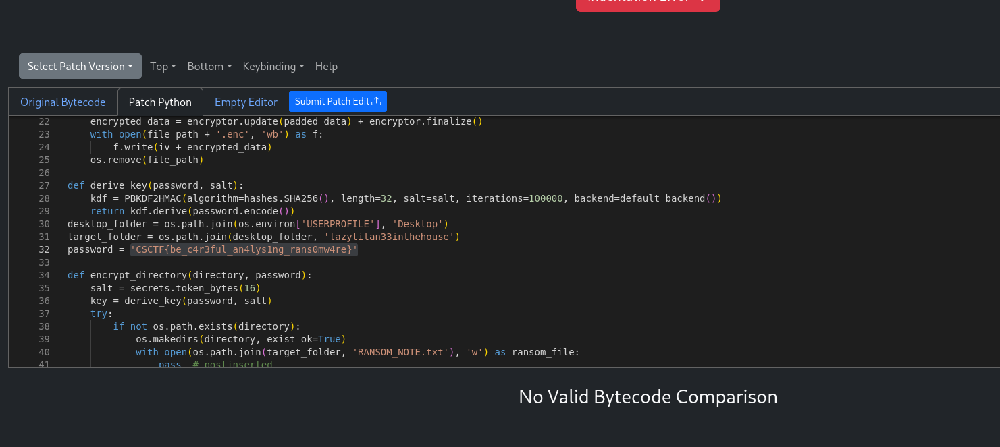

## Ransom -> 100p
# Category -> Rev

---

First, I tried looking with `strings` for the `CSCTF{` pattern; no luck in finding the flag, but it gave me some precious informations!

The massive list of python modules (cryptography, hashlib, urlib) confirms that this file is actually a Python script bundled into an executable using `PyInstaller`.

I used `pyinstxtractor` to unpack the .exe . It created a new folder with all the bundled files.

Since the name of the challenge is 'Ransom', the file 
`-rw-rw-r-- 1 tudor tudor    4596 Nov  9 02:14 ransom.pyc `
might be our key to answer.

Because uncompyle6 has some problems decompiling python files (3.12), I used `https://pylingual.io/`.

There it is our flag!