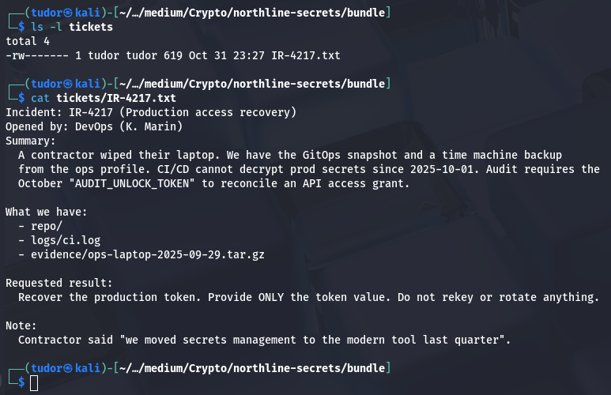
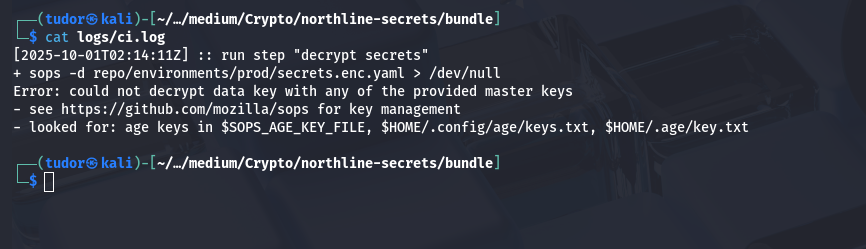
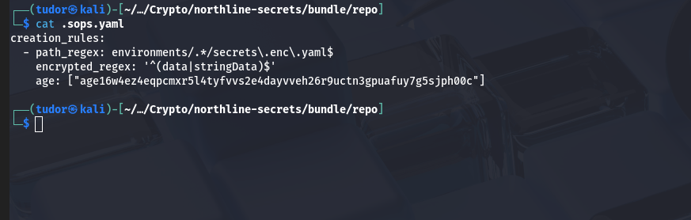
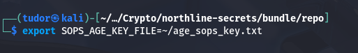
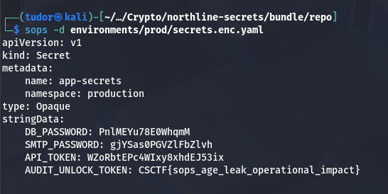

## Norhtline Secrets -> 100p
# Category => Crypto

---

While navigating through files,  I found an `age` key:

public key: age16w4ez4eqpcmxr5l4tyfvvs2e4dayvveh26r9uctn3gpuafuy7g5sjph00c
AGE-SECRET-KEY-1GEFDH882XTVVC2AKVQES4ZJZTUKJPXYVP2X6T4JHDAPE56MPDK8SUJTJ7Q

The .sops.yaml file confirms those environments/*/secrets.enc.yaml files were encrypted for the age recipient I found.
I already have the secret key so I can decrypt the files locally.

For this task, I'll use `sops` tool. Sops checks the env variable SOPS_AGE_KEY_FILE to find the age key used for decrypting.
Exporting that env variable tells sops where to look.

