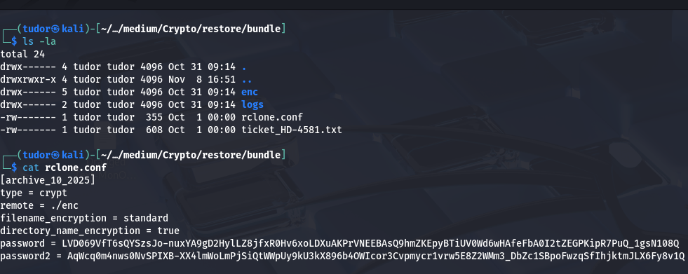
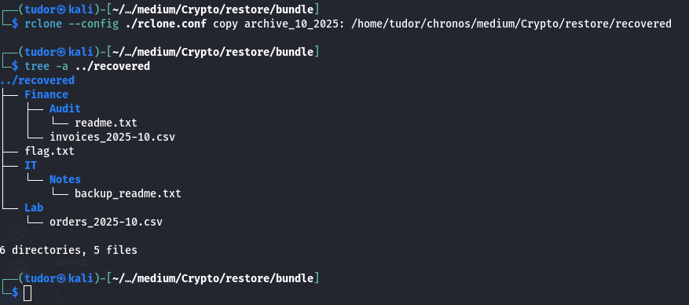
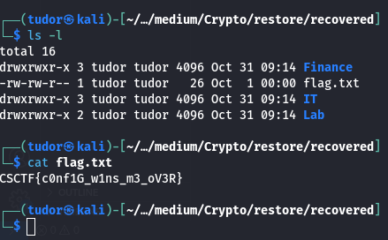

## Rstore -> 100p
# Category => Cryptography

---

The given archive contains:

-> `rclone.conf` = a config for rclone's crypt backend. It contains the keys(password and password2) and tells rclone where the encrypted data is :

-> `enc` the encrypted export. filenames and contents are ciphertext
-> `logs/sync.log` (empty in our case)

password decrypts the file contents while password2 decrypts filenames and directory names

For this task, I'll use `rclone` tool.

I copied the `[archive_10_2025]` into a directory and then ran the tree list command:

There they are, the encrypted files and also our flag!

