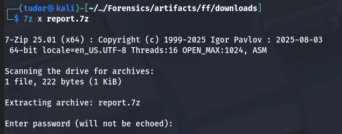
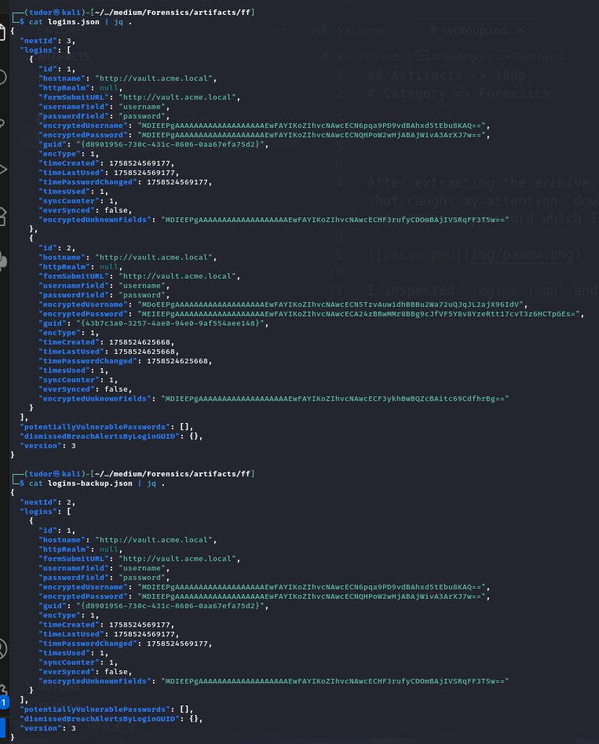
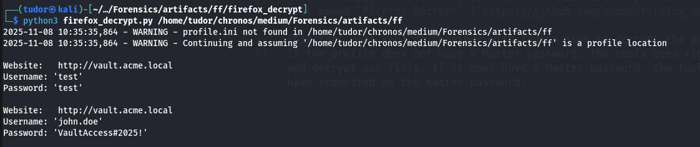
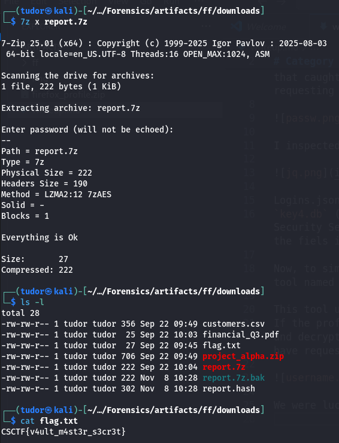

## Artifacts -> 100p
# Category => Forensics

---

After extracting the archive, I looked at the files and found a directory that caught my attention `downloads`. Inside, there was a 7-zip archive requesting a password which I didn't have at that time.

I inspected `logins.json` and `logins-backup.json` and got this:

Logins.json keeps saved entries, but the passwords are encrypted.
`key4.db` (in the main directory) is the database used by NSS(Network Security Services) in Firefox which keeps the necessary keys to decrypt the fiels in `logins.json`.

Now, to simply extract the passwords from this firefox profile, I used a tool named `Firefox Decrypt` (`https://github.com/unode/firefox_decrypt`).

This tool uses key4.db together with logins.json to decrypt the passwords.
If the profile does not have a Master password, the tools goes right away and decrypt our fiels. If it does have a Master password, the tool would have requested me the master password:

We were lucky this time.

Final step: use the given password `VaultAccess#2025!` to extract the archive and get our flag!

