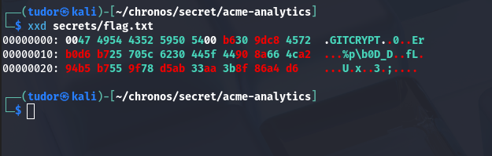
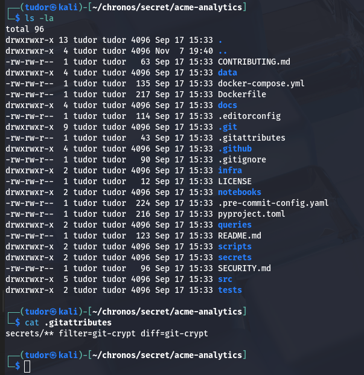
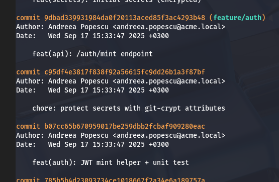
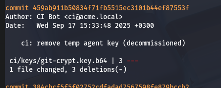
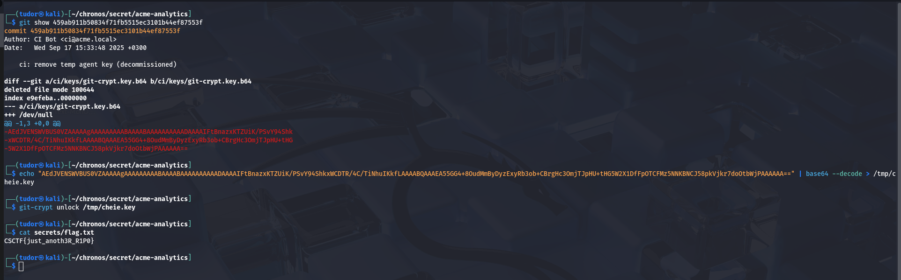

## Secret -> 100p
# Category => Misc

---

Inside the extracted archive I found `flag.txt` encrypted with git-crypt:

I have to found the key to decrypt it.

This confirms that flag.txt and other files inside secrets are protected with git-crypt.
The challenge is giving a hint to look at commits, and I got this:

Ok so this commit only added the rule inside .gitattributes, but I found this commit:

There it is our decrypted flag!