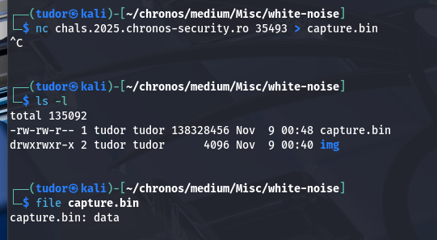

## White noise -> 400p(but descending...)
# Category -> Misc

---

When I connect to the server, it just spams "junk". The netcat is trying to print raw binary data.
This looks like a classic find the signal in the noise challenge.

Instead of just looking at the entire stream of junk, let's capture some of it. I will keep the connection for about 10 seconds then press Ctrl-C. In this time, all the output will be redirected to a file which I will analyze.

Now, let's look for our flag format "CSCTF{...}":

There it is the flag!