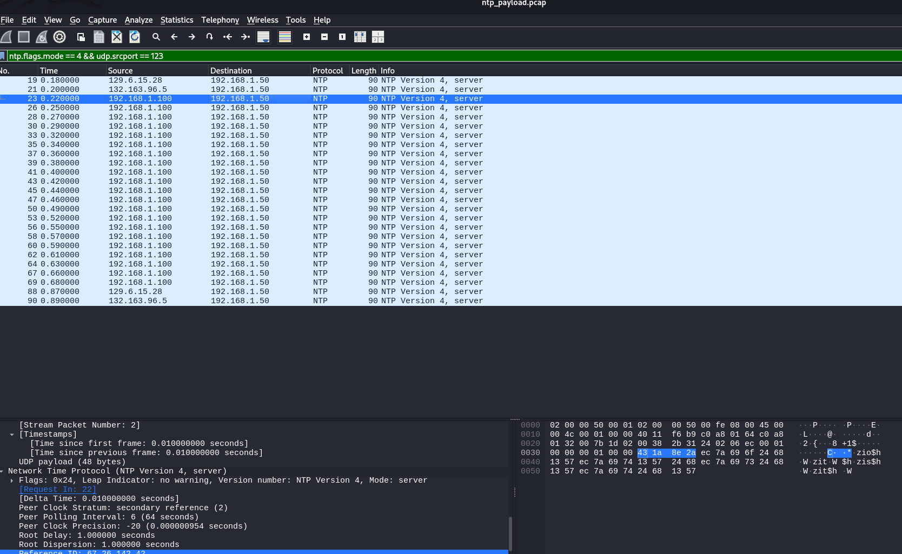
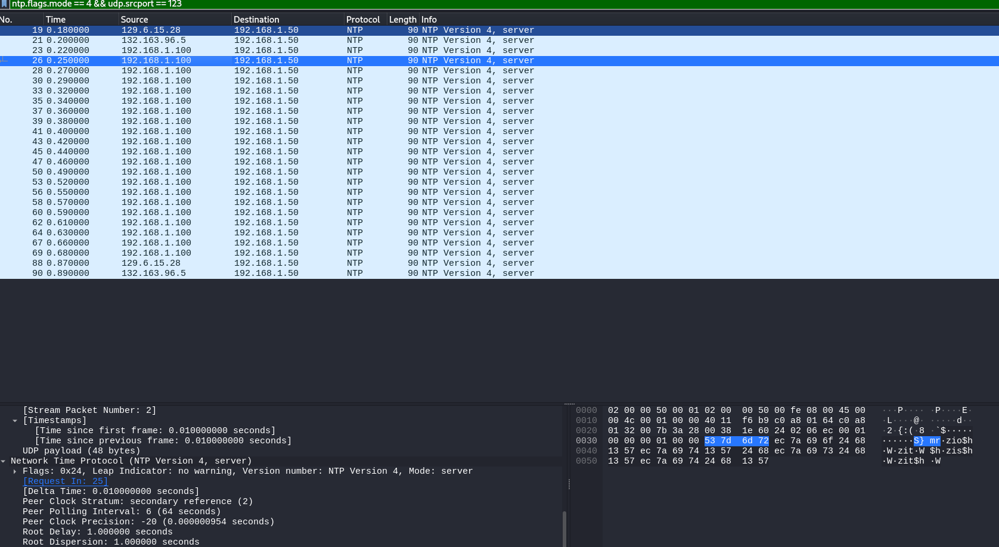
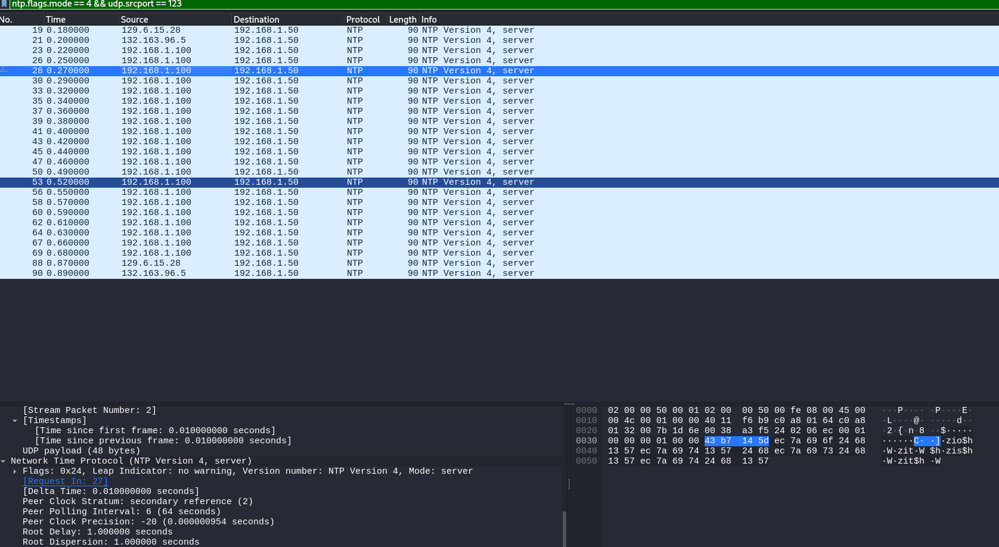

## Time-gone -> 100p
# Category => Network(Forensics)

---

The challenge tells me to find something suspicious in NTP protocol packages.
While looking at the packages, I observed that the packages sent by the server actually contain some characters besides that gibberish at the end of every package.

I used `ntp.flags.mode == 4 && udp.srcport == 123` as a filter so I can see only server requests. Every `Reference ID` field's value(starting from the 3rd packet) has one character that belongs to our flag:
(also remove the last 2 bytes)

CSCTF{.. and so on.

I will write a quick script to receive only the first byte from every packet:

