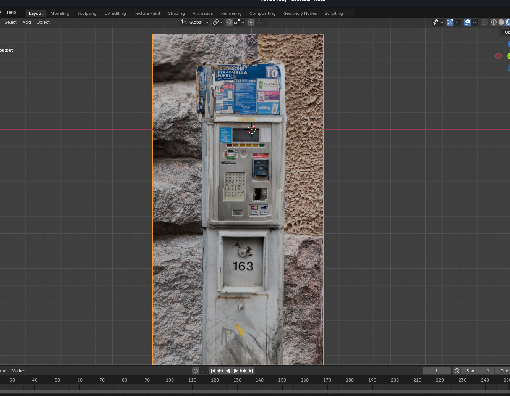
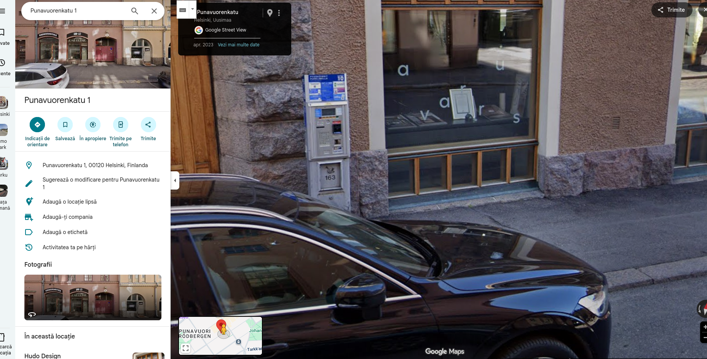

## Sakot -> 100p
# Category => OSINT

---

-> `textured_output.obj` → 3D mesh 
-> `textured_output.mtl` → material file, references the texture
-> `textured_output.jpg` → texture image

I opened the model in blender:

Ok so there are a lot of clues:
-> the language is Finnish
-> the number "1" indicates it's Parking Zone 1
-> the number "10"  "ALUE / OMRÅDE 10" means the zone/area 10
    => it's an area code used by parking apps like ParkMan

I started searching for parking tickets machine on  `https://palvelukartta.hel.fi/en/unit/35840?p=1&t=basicInfo`, and after a few minutes(hours) of searching I find the right machine at :

`Punavuorenkatu 1, 00120 Helsinki, Finlanda`.

So the coordinates were `@60.1617565,24.9396428`

