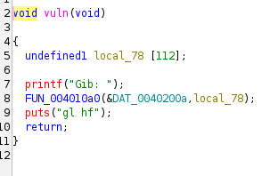
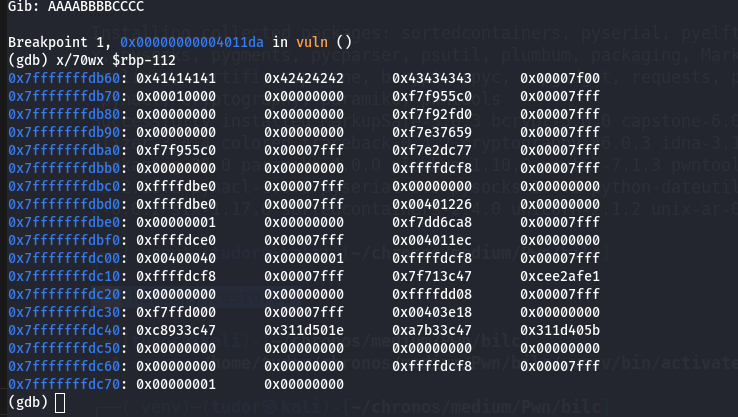
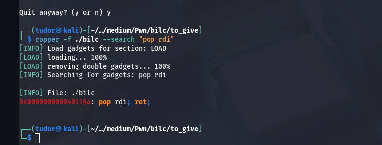
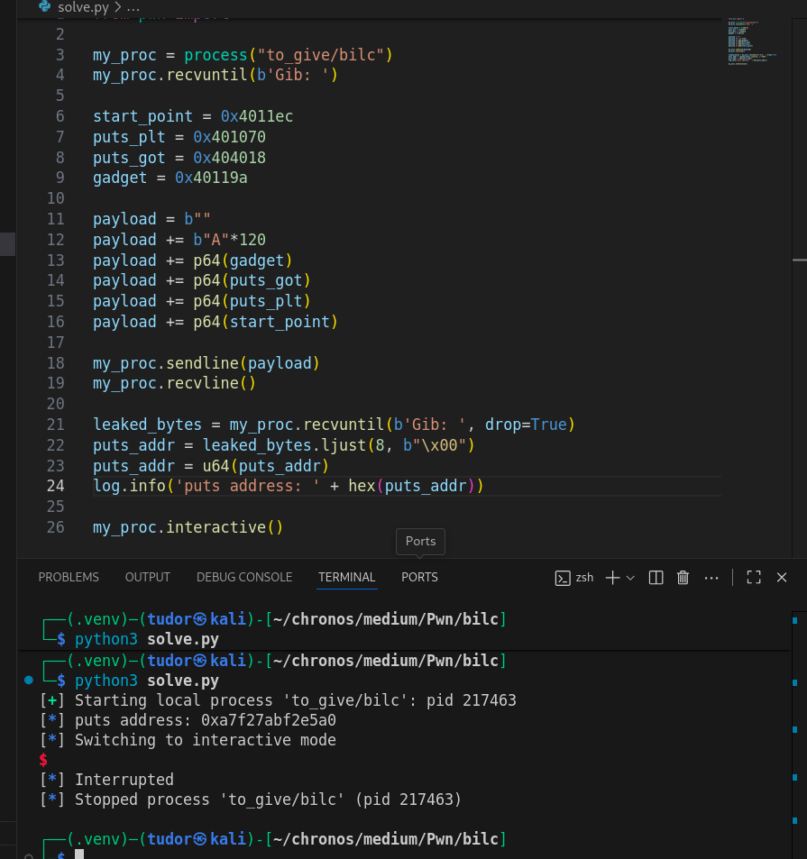
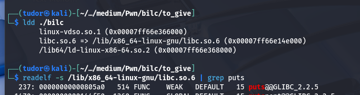
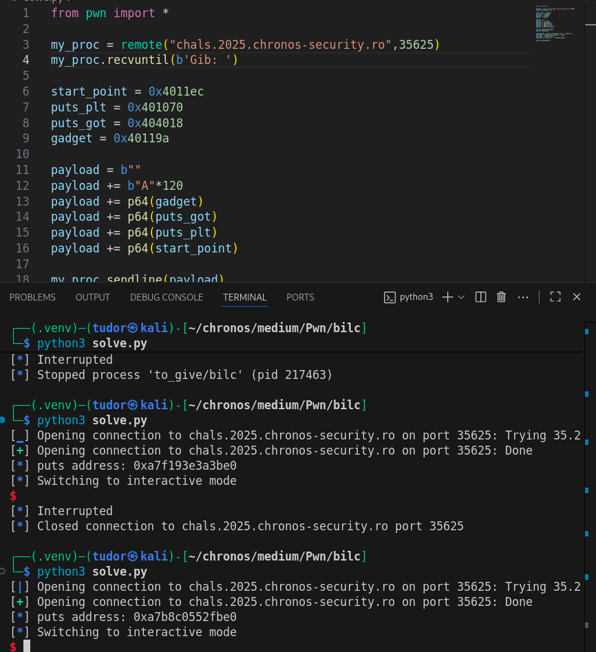
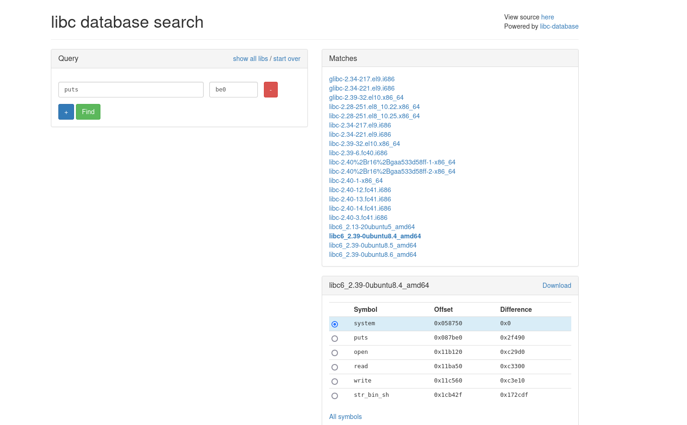
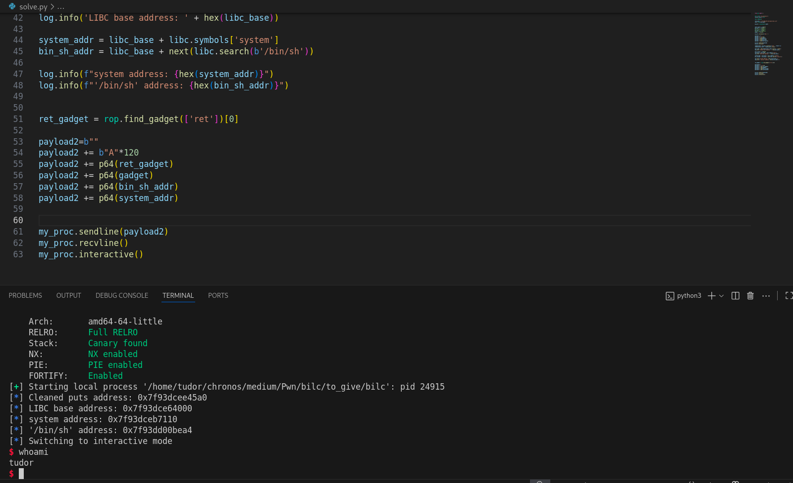
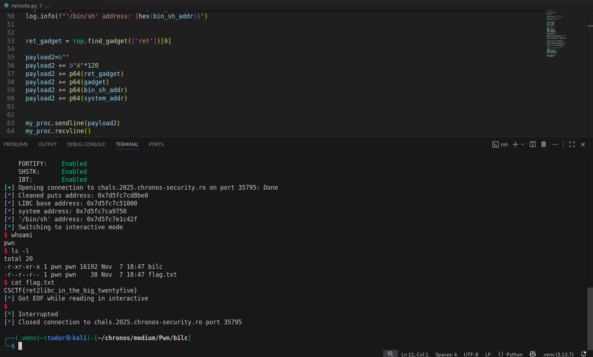

## Bilc -> 416p
# Category => Pwn

---

This is a basic ROP pwn challenge:







We want to overwrite the $rip register with the address of the gadget pop rdi; ret? Why ? Because we want to call the `puts_plt` function with `puts_got` to find the address of puts in the `libc` .

If we find that address, we will then have the libc address( - puts offset in the libc version). After this call, the program has to jump at start so we can continue with the second step of the ROP.



This is puts address in libc. Libc address = puts_address - puts_offset



But the problem is, maybe the remote server doesn't use the same libc version... Let's check



Since I have the last 3 nibbles of the function puts, I can find the right libc version on `https://libc.blukat.me/?q=puts%3Abe0&l=libc6_2.39-0ubuntu8.4_amd64`:



I think this is the libc version the remote host is using, we'll try it later.

For now, I have to continue with the second step of the rop.

We got the libc base address (`libc_base = puts_addr - puts_offset_in_libc`). Why we need it? Because the libc is dynamically linked at runtime and it contains the `system` function but also the string `/bin/sh`. We will push on stack the stack alignment ret, the pop rdi;ret gadget, /bin/sh string and the last one, system function.

``` py

libc_base = puts_addr - libc.symbols['puts']
system_addr = libc_base + libc.symbols['system']
bin_sh_addr = libc_base + next(libc.search(b'/bin/sh'))


ret_gadget = rop.find_gadget(['ret'])[0]

payload2=b""
payload2 += b"A"*120
payload2 += p64(ret_gadget)
payload2 += p64(gadget)
payload2 += p64(bin_sh_addr)
payload2 += p64(system_addr)


```



So we have have the blueprint of our script, now I just have to modify this program for the libc I found on the remote address.(libc path changes to `libc_path = "./libc6_2.39-0ubuntu8.4_amd64.so"`).

Let's run the `remote.py` script:



We got access and there it is our flag!