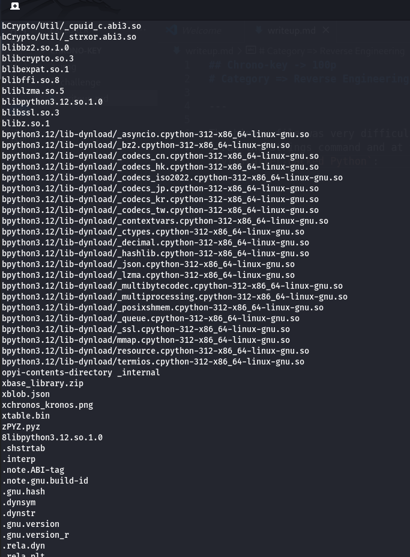
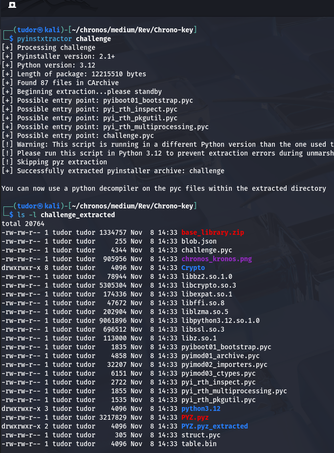
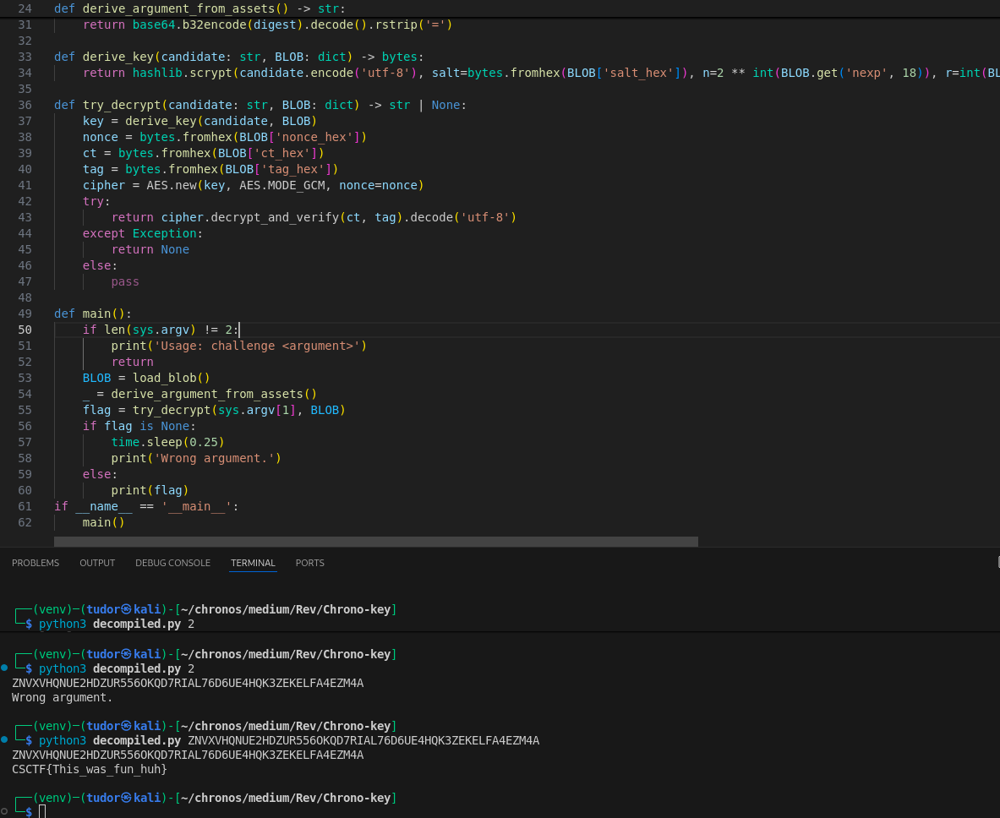

## Chrono-key -> 100p
# Category => Reverse Engineering

---

The binary file was very difficult to read in ghidra.
I ran the strings command and at the end of the file there were a lot of strings that suggest `PyInstaller-packed Python`:



I don't need hardcore reverse engineering : Just unpack -> decompile the .pyc and read the python script.

First, I need to extract the contents of the binary. The best tool for this is `pyinstxtractor`:



There it is our .pyc file.

Decompyle3 has trouble with python 3.12, uncompyle6 the same, but I found an online decompiler:
`https://pylingual.io/`

I imported my `challenge.pyc` and got back the original script, in `decompiled.py`.

The script required the `blob.json`,`chronos_kronos.png`, `table.bin` files that are in our challenge_extracted directory:

``` py

def load_blob():
    with open(resource_path('blob.json'), 'r', encoding='utf-8') as f:
        return json.load(f)

png = open(resource_path('chronos_kronos.png'), 'rb').read()
blob = open(resource_path('table.bin'), 'rb').read()

```

At the startup, the program computes a deterministic argument from the shipped assets enumerated before, `using derived_argument_from_assets()`.

That argument string is meant to be inputed on the command line. The program takes that argument I provide and runs it through `derive_key()` to obtain a symmetric key.

Then, it calls try_decrypt() which uses AES-GCM. If the verification is ok, it prints the flag.


