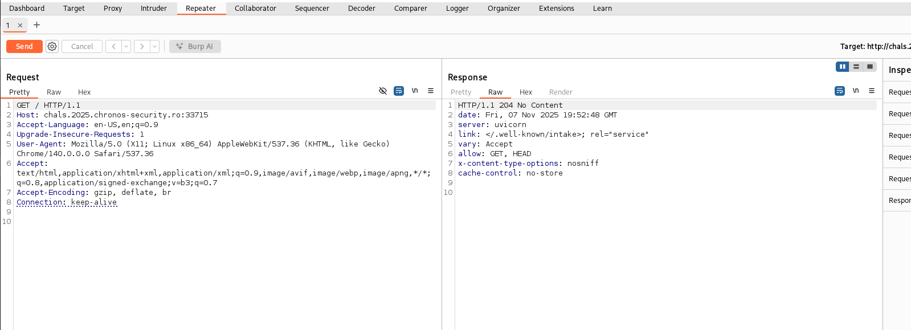
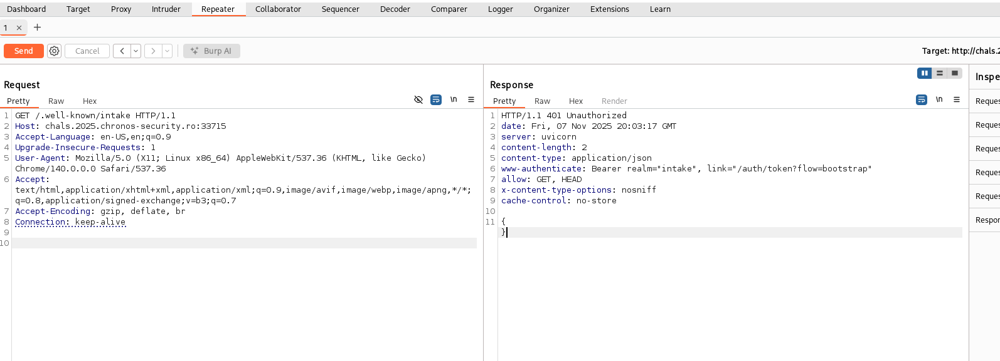
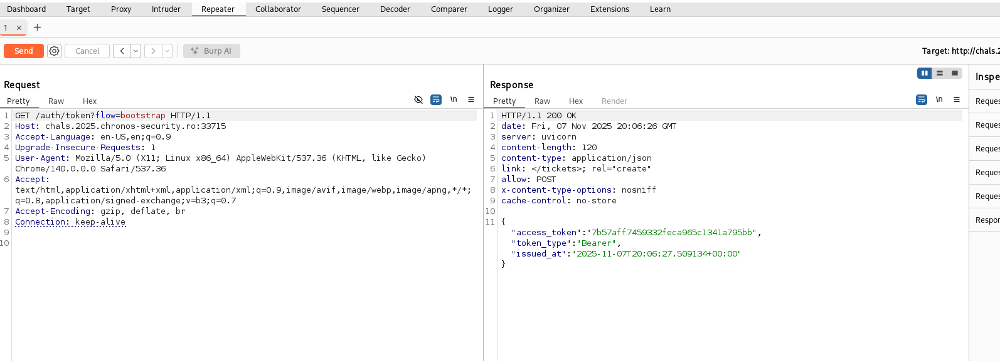
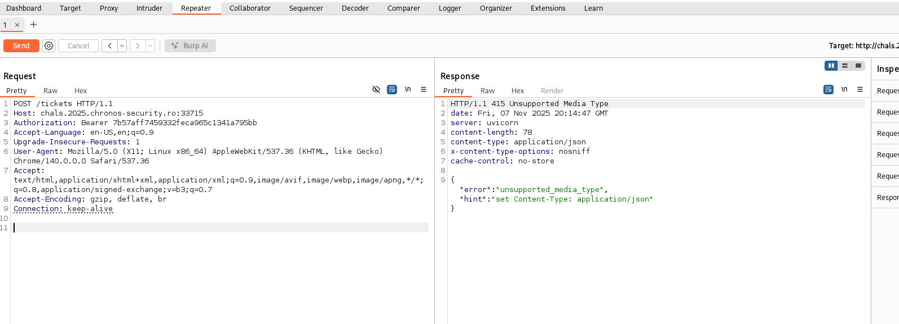
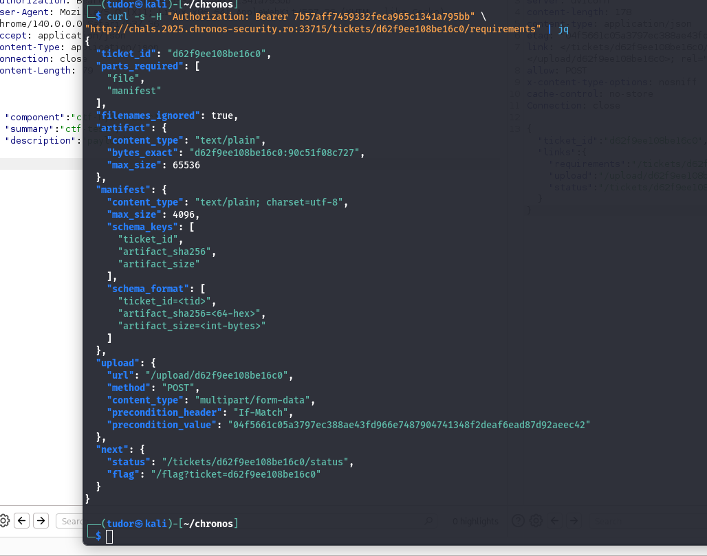
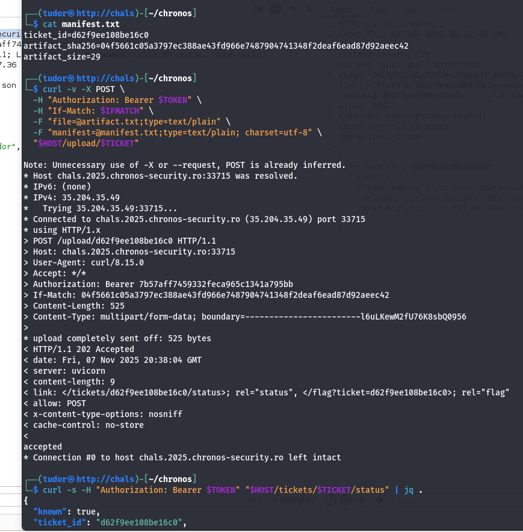
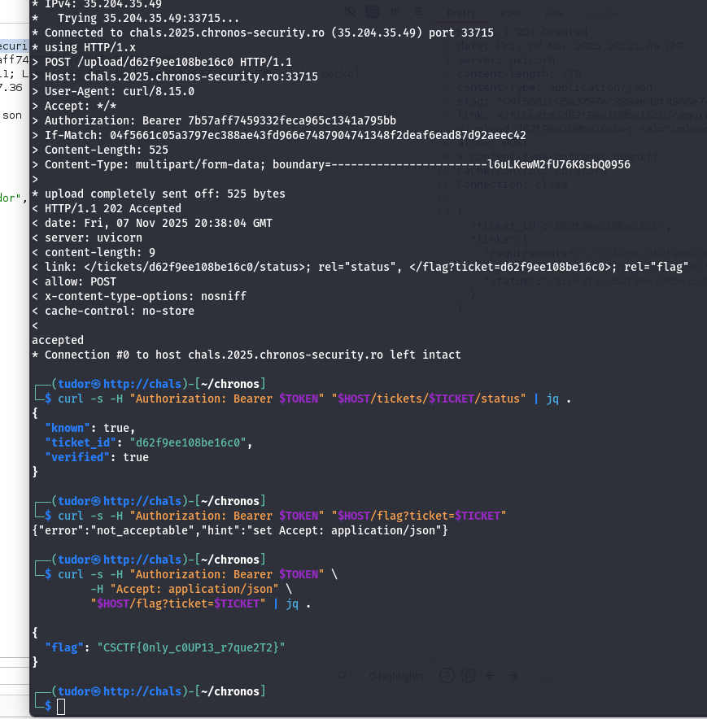

## Requests -> 366p
# Category => Web

---

I tried to intercept the request on burp suite and got this:



`204 No content` succsessful response status code indicates that a request has succeeded, but the client doesn't need to navigate away from its current page

`link: </.well-known/intake>; rel="service"` = the service exposes an API
The app is an API(uvicorn) - not a web page.

When I tried to access /.well-known/intake I got this response:



The `www-authenticate` field tells me I have to send a token inside the header to gain authorization, but also where I can find my token `link="/auth/token?flow=bootstrap"`.



Let's go! We got our token!

``` bash

{
    "access_token":"7b57aff7459332feca965c1341a795bb",
    "token_type":"Bearer",
    "issued_at":"2025-11-07T20:06:27.509134+00:00"
}

```



Ok, the response tells me I need to modify my request so that the server returns JSPN.

I sent a ticket POST request and got this answer:


``` bash

HTTP/1.1 201 Created
date: Fri, 07 Nov 2025 20:21:49 GMT
server: uvicorn
content-length: 178
content-type: application/json
etag: "04f5661c05a3797ec388ae43fd966e7487904741348f2deaf6ead87d92aeec42"
link: </tickets/d62f9ee108be16c0/requirements>; rel="requirements", </upload/d62f9ee108be16c0>; rel="upload", </tickets/d62f9ee108be16c0/status>; rel="status"
allow: POST
x-content-type-options: nosniff
cache-control: no-store
Connection: close

{"ticket_id":"d62f9ee108be16c0","links":{"requirements":"/tickets/d62f9ee108be16c0/requirements","upload":"/upload/d62f9ee108be16c0","status":"/tickets/d62f9ee108be16c0/status"}}


```



So the requirements are very explicit:
-> `file` must be text/plain, less than 65536 bytes
-> `manifest` must be text/plain, charset = utf-8, less than 4096 bytes
and must contain the three lines format below.

Let's craft the request:


Now that I have all the reqs filled, I'll sent the request:



This is a multipart POST request containing 2 parts: file and manifest.
The server identified the match IF Match, the token from authorization field, manifest(tiket id, artifact_sha256, artifact_size), file.

The response -> the upload was accepted and processed



the response from the get request to /ticket/status confirms that artifact and file bypassed the validation

I tried to get the endpoint of the flag, but the server response had a hint: to set the Accept value "application/json" and there it is our flag!